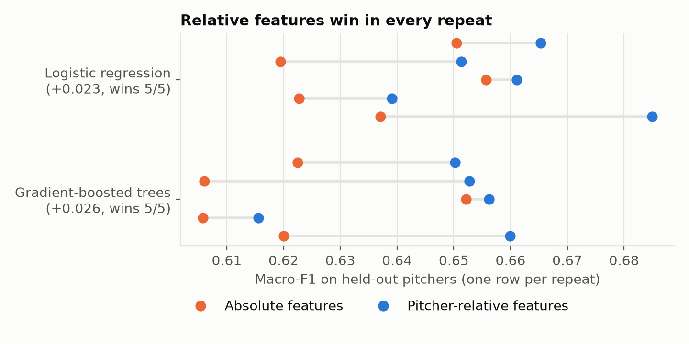
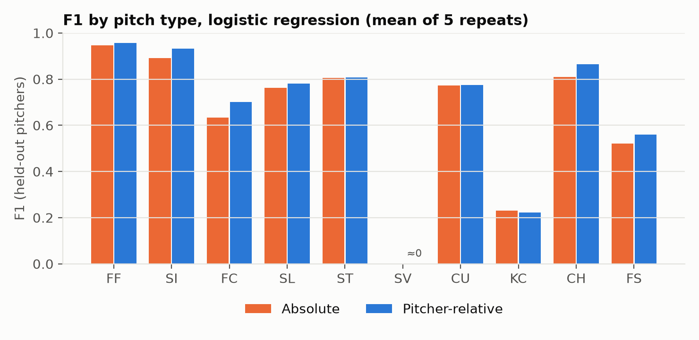
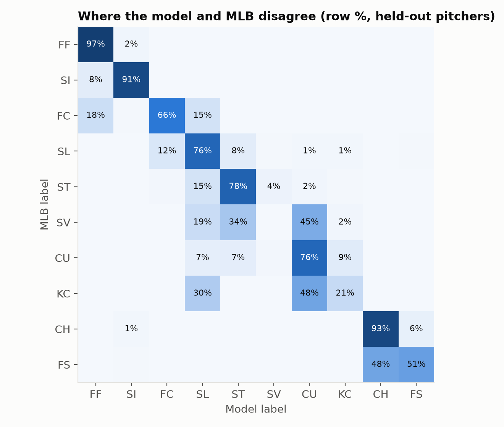
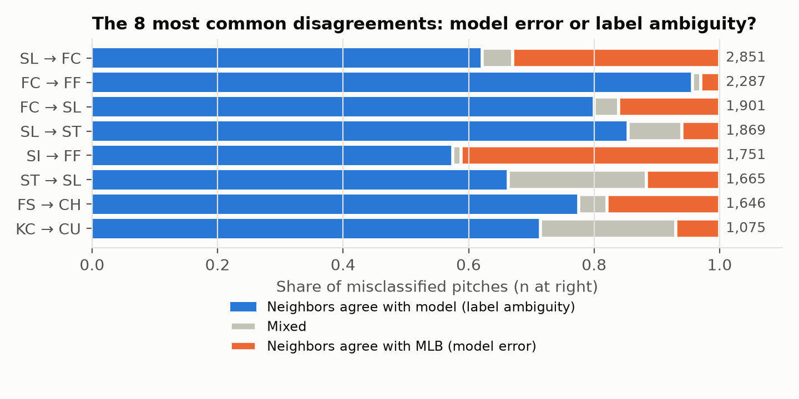

# Pitch types are relative

**What it is:** a classifier that recovers MLB's pitch-type labels from ball flight, for pitchers the model has never seen. When it disagrees with MLB, it checks whether the model is wrong or the label is.

**Data:** the full 2025 MLB regular season from public Statcast. That's 712,528 pitches from all 2,430 games, verified against MLB's official schedule; 699,305 pitches from 723 pitchers remain after cleaning.

**Author:** Andres Perez. This rebuilds a 2021 class project (NCAA pitch-type classification) with stricter validation and a sharper question.



## Key findings

**1. About 85% of pitches are recovered for brand-new pitchers, but the average hides a lot.**
- Validation holds out 20% of pitchers entirely, 5 repeats.
- The best model is a plain multinomial logistic regression on pitcher-relative features: accuracy 0.849 (SD 0.009), macro-F1 0.660 (SD 0.017), log loss 0.43. For scale, always guessing "four-seam" scores 0.316 on the same held-out pitchers.
- Four-seamers, sinkers and changeups are recovered well (F1 0.87 to 0.96).
- Splitters (0.56), knuckle curves (0.22) and slurves (≈ 0) mostly are not.



**2. Describing a pitch relative to the pitcher's own fastball helps logistic regression in every repeat.**
- The relative features are gaps from the pitcher's hardest pitches: velocity, movement, spin and spin axis.
- For logistic regression they raised macro-F1 in **5 of 5** repeats (+0.023), which meets the pre-declared rule.
- The share of pitchers whose whole arsenal is classified at least 95% correctly rose from 21% to 30%.
- For the gradient-boosted trees the gain was smaller and won only **4 of 5** repeats (+0.018). Under the same rule, that does *not* count as a finding.
- The reference is label-free (each pitcher's top 10% of velocities), so it works for a pitcher the model has never seen, given a reasonable sample of that pitcher's pitches (every pitcher here has at least 100). In this data the reference pitches are 99.98% fastballs (71.7% four-seam, 27.0% sinker, 1.3% cutter).

**3. Flexible models did not help. Logistic regression beat gradient-boosted trees, tuned or not.**

| Model (relative features, held-out pitchers) | Accuracy | Macro-F1 | Log loss |
|---|---|---|---|
| **Logistic regression** | **0.849** | **0.660** | **0.43** |
| Boosted trees, plan's fixed settings (300 rounds) | 0.807 | 0.619 | 2.86 |
| Boosted trees, rounds tuned on held-out pitchers *(exploratory)* | 0.840 | 0.649 | — |

- With the plan's fixed settings, the trees overfit the training pitchers. The predictions were badly overconfident (log loss 2.9).
- Choosing the number of rounds on a held-out *group of pitchers* fixed most of that: the trees stopped at about 53 rounds. Logistic regression still won all 5 repeats on both accuracy and macro-F1.
- This suggests that what separates pitch types *across* pitchers is mostly simple in these features, and that extra flexibility mostly learns individual pitchers' naming habits, which don't transfer.

**4. Many disagreements look like inconsistent labels, not model mistakes.**
- For each misclassified pitch in the first repeat's test set (141,025 pitches from 145 held-out pitchers), I took its 50 nearest neighbors among *other* pitchers' training pitches, in the same feature space. Then I asked whether most of them carry MLB's label or the model's.

| Model | Errors | Most neighbors carry the model's label (label ambiguity) | Most neighbors carry MLB's label (model error) | Mixed |
|---|---|---|---|---|
| Logistic regression | 20,365 | 64% | 22% | 14% |
| Boosted trees (pre-specified main model) | 26,668 | 52% | 34% | 14% |

- Examples from the best model: of the 1,849 cutters it called four-seamers, 95% sit in neighborhoods where other pitchers' pitches are mostly four-seamers. The same holds for 88% of sliders called sweepers and 81% of splitters called changeups.
- Knuckle curve vs curveball is largely a grip difference, and ball flight can't see grip.
- Kenley Jansen shows the cutter/four-seam boundary in its purest form. His signature pitch is labelled a cutter, but it *is* his fastball, and to the model it looks like one: only 18% of his pitches match MLB's labels.
- One instructive model failure: 708 of the 736 sinkers the model called knuckle curves belong to one submarine pitcher (Tyler Rogers). His 83 mph sinker drops about 13 inches, like a curveball from anyone else. A model trained on the population struggles with extreme arm angles even though arm angle is one of its inputs. Clustering within each pitcher is the natural next step to test.




> **Reading the ambiguity check carefully:** a classifier tends to follow its local majority, so "neighbors agree with the model" is partly built in. The informative part is the other direction. For the best model, only about one error in five sits in a region where other pitchers would agree with MLB. Most of the rest are pitches whose name depends on who throws them, not on how they move. The trees' larger model-error share is consistent with the overfitting above.

## Why this matters

A pitch label is a pitcher's own naming decision, not a physical category. That's fine for describing an arsenal. It's a problem when labels are used as model inputs across pitchers (pitch-type splits, pitch-quality models). A slider for one pitcher can be another's cutter. Pitcher-relative physical descriptions, or clustering within each pitcher, are safer.

## Interactive app

**Live app:** *link added once deployed.* `app.py` (Streamlit) lets you pick any held-out pitcher and compare MLB's labels with the model's (logistic regression) in movement space, side by side. A table lists the disagreements. Sort by "most disagreement" to find the interesting arsenals.

```bash
streamlit run app.py
```

## How it was done

- **The plan came first.** [`ANALYSIS_PLAN.md`](ANALYSIS_PLAN.md) fixed the label set, features, models, validation and decision rules. It was committed before the season download finished and before any model was fit. Changes made afterwards, including problems I found in my own review, are logged in [`DEVIATIONS.md`](DEVIATIONS.md).
- **Complete data.** Savant caps each export at 25,000 rows, so the fetcher pulls one day per request and fails loudly on the cap or on an error page. It then checks the result against MLB's official schedule: every final game must be present, and no others.
- **One frame of reference.** Left-handers are mirrored so every pitch is described from the pitcher's side, with arm side positive. Checked in the data: after mirroring, left- and right-handed four-seamers match (median release side 2.1 vs 1.8 ft, horizontal break 8.0 vs 7.8 in, spin axis 215° vs 214°).
- **No label leakage.** The pitcher reference uses no labels and is computed separately within the training and test splits.
- **Honest validation.** GroupShuffleSplit by pitcher, 5 repeats, with the training set subsampled to 250k pitches. Metrics are accuracy, macro-F1, log loss, per-class F1 and a pitcher-level "whole arsenal" rate.
- **No hidden tuning on seen pitchers.** scikit-learn's boosted trees early-stop on a random 10% of rows by default. That would tune the model on pitchers it trains on, so it's switched off (and tested). The exploratory tuned version holds out whole pitchers instead.
- **Tests (7).** `tests/` checks:
  - left-hander mirroring and the arm-side-positive convention
  - cleaning merges, drops and logs correctly
  - relative features ignore labels and handle the 0°/360° spin-axis wrap
  - the error-classification rule and the neighbor lookup
  - boosted trees have no hidden early stopping

## Repository layout

```
ANALYSIS_PLAN.md      questions, models and decision rules, frozen before modeling
DEVIATIONS.md         every post-plan change, dated, with its reason
src/pitchtype/        cleaning, handedness frame and relative features; models and the ambiguity check
scripts/              fetch_statcast (with schedule check), run_analysis, make_figures, data_checks, exploratory_tuned_gbm
app.py                Streamlit arsenal explorer
tests/                unit tests (pytest)
reports/              tables and figures
```

## Limitations

- **The labels are the target, not ground truth.** MLB's labels come from its pitch-classification system, and pitchers name their own pitches. MLB can also revise labels after the fact, so a later download may differ slightly.
- **Scope:** one season, and pitchers with fewer than 100 pitches are excluded.
- **Fragile reference:** the hardest-pitch reference assumes the fastest pitches are fastballs. That held for 722 of 723 pitchers here, but it can fail for pitchers who rarely throw a fastball, and it needs enough of a pitcher's pitches to be stable.
- **Position players:** one position player (103 pitches, under 0.02% of the data) passes the 100-pitch filter. His 55 mph "curveballs" are kept as labelled.
- **Rare classes:** slurves (0.5% of pitches) and knuckle curves (1.8%) are rare. Their low F1 partly reflects that, though the confusion matrix shows naming overlap with curveballs and sweepers is the bigger factor.

## Reproduce

Requires Python 3.11 or newer.

```bash
python -m venv .venv && source .venv/bin/activate
pip install -r requirements.txt
python scripts/fetch_statcast.py --season 2025     # about 30 min, polite one-day requests
python scripts/run_analysis.py                     # about 10 min on a laptop
python scripts/make_figures.py
python scripts/data_checks.py                      # descriptive checks quoted above
python scripts/exploratory_tuned_gbm.py            # optional, about 10 min
pytest -q
streamlit run app.py
```

Data: Baseball Savant / Statcast (MLB Advanced Media), public pitch-level data. The raw data are not redistributed; the repo includes one small derived file (`data/processed/test_predictions_seed0.parquet`, held-out pitchers' summary values and model labels) so the app runs without the download. Code: MIT.
